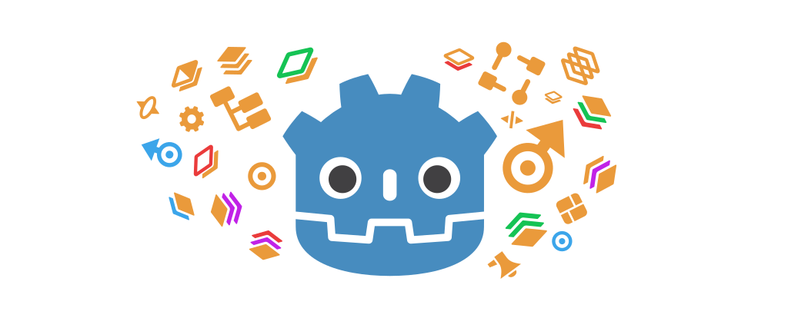

# BehaviourToolkit

This plugin provides a set of tools to create custom and complex behaviour in the Godot 4.x Game Engine.

    
    
    
        
    
    
    
    
    
    
    
    
    
    
    
    
    

### Features
-  Behaviour Architectures
    -  Finite State Machine
    -  Behaviour Tree
-  Blackboard Resource
- Editor Interface
- [Templates](#using-templates) for easy extension and integration.

## Usage
Make sure the clones the `addons` and `script_templates` directories into your project.

1. Add a `FiniteStateMachine` or `BTRoot` node to your scene.
2. A toolbox will appear in the editor, allowing you to add behaviour nodes to the scene.
3. Setup and configure your behaviour nodes in the inspector.
4. Right-click your `FSMState`/`FSMTransition`/`BTLeaf` and extend the script.

Now you can implement your own behaviour logic using the virtual methods provided by the script templates.

## Documentation
-  [Finite State Machine](docs/docs_finite_state_machine.md)
-  [Behaviour Tree](docs/behaviour_tree.md)

> **Note:** Use the in-engine documentation [F1] for more information on the individual nodes and their properties.

## Using templates 
When cloning this repository/importing the plugin, make sure to not only add the `addons` directory to your project, but also the `script_templates` directory. This allows you to have preconfigured script templates when extending behaviour nodes, providing you with virtual methods and a logical naming scheme.

## Examples
